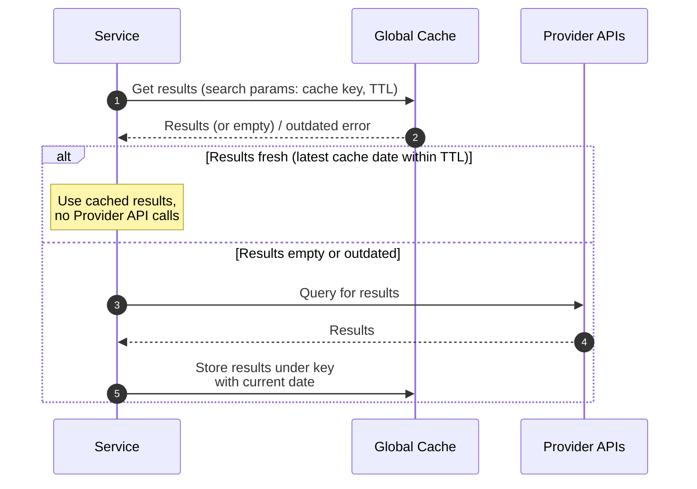
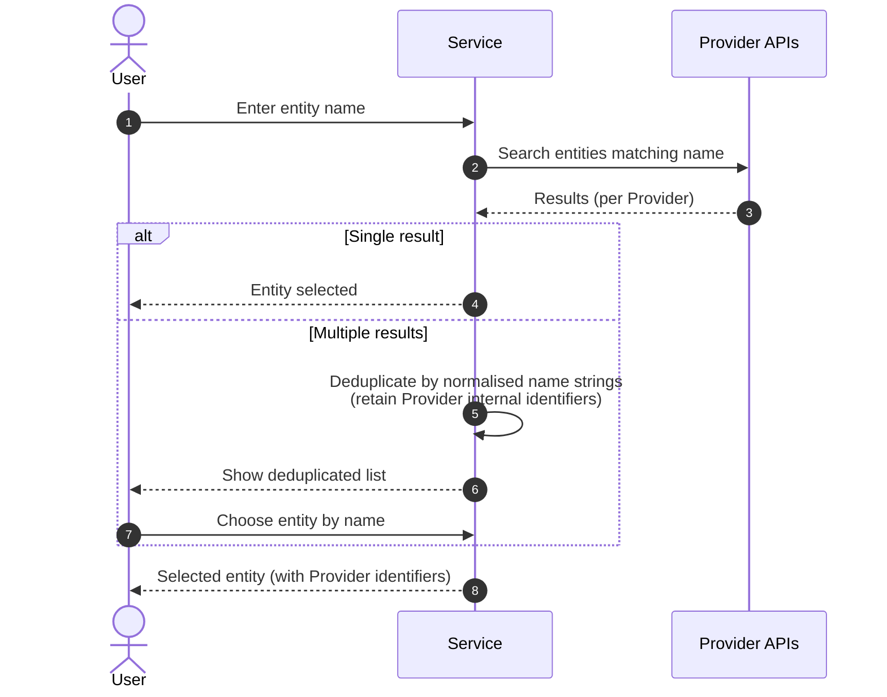
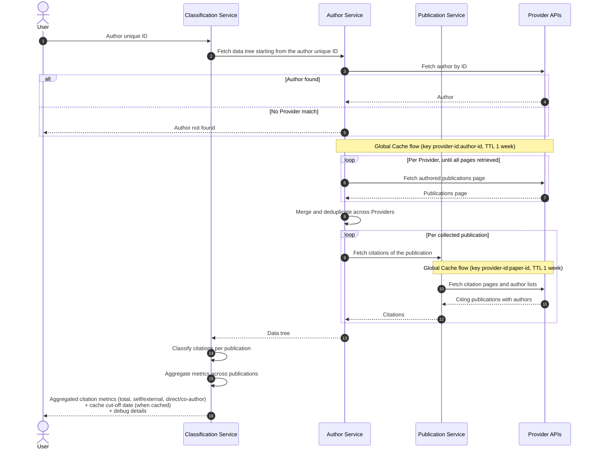
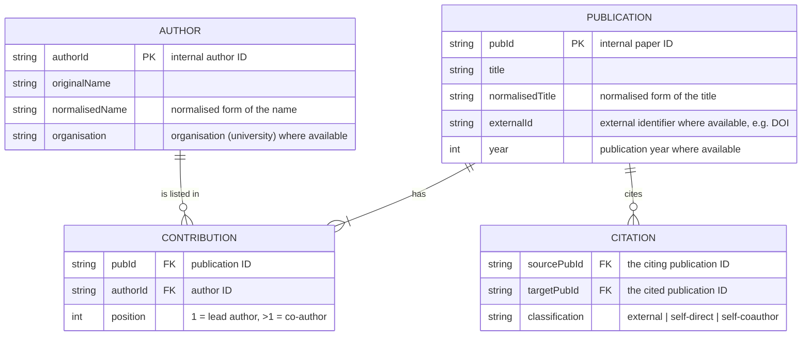
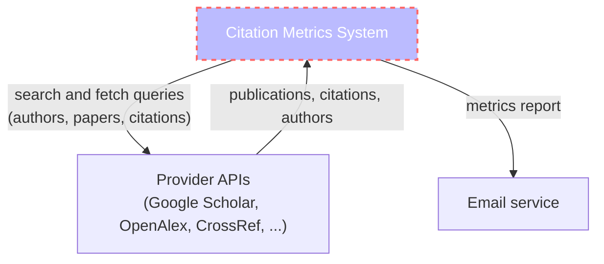
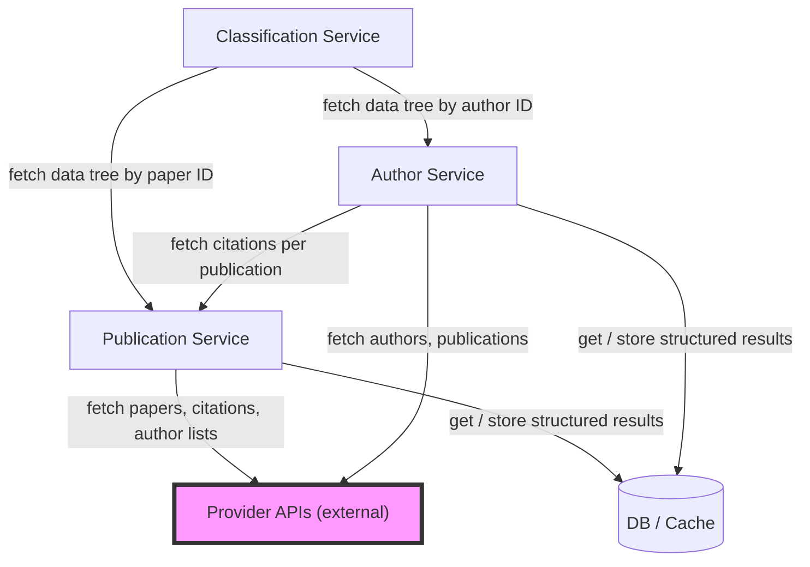
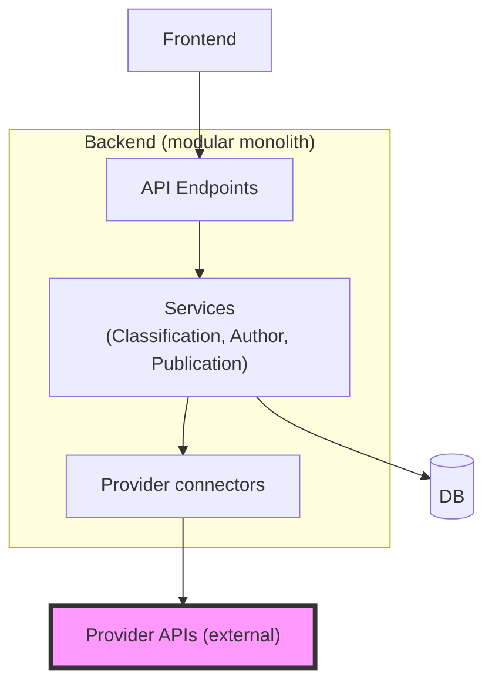

# System Design to Identify Self Citations in Scientific Publications

## Background and Problems Statement

The [main document](./text/Saunkin.tex) outlines the background and the problem statement.

In summary, we classify the bibliography citations of a publication as

- *self citations* - same authors, and
- *external citations* - different authors.

The self citations are further distinguished per paper, as

- *direct* - where the lead author is same as the cited lead author, and
- *co-author* - where the lead author is listed as author, but the name appear in positions greater than 1.

Collectively, the distinction of citations into self/external and the further break down of the self citations into direct and co-author, is called *citation metrics*.

Additional to the direct citation distinction, there are *circular citations* - when authors of a paper cite second papers, that cite third papers, and so on, until they eventually create a closed loop in the citation graph to end up to the authors of the original paper.

## Requirements

### Functional

- As a user
  - I want to
    - [high] Find citation metrics of a paper
      - So that I can evaluate how impactful it is
    - [high] Receive debug details of the citation metrics
      - So that I can manually confirm the metrics
      - The debug details should include the data used to produce the metrics (papers, authors)
    - [high] Identify the exact author I want to evaluate
      - So that I avoid skewing metrics from irrelevant data points
    - [high] Find aggregated citation metrics of an author
      - So that I can evaluate how impactful their work is
    - [medium] Detect circular citations
      - So that I can evaluate the actual impact regardless of the citation obfuscation
    - [medium] View a representation of the citation graph
      - So that I can visually understand the loop

### Non-Functional

- Insist on the latest data
  - The system may cache data for some time (quantify)
    - When the system uses cached data, it shows the cut-off date
- Support as much of open data as possible (quantify)
- The system returns results instantly or as a report over email
- The system must run on a laptop (no dedicated server)
- The system must not depend on paid subscriptions

### Out of Scope

- Infrastructure and deployment - this project focuses on the methodology and the software required to provide a functional proof of concept. The production grade deployment (with support for scaling, backups, infrastructure provisioning etc) is out of scope.

## Scenarios

### Abstract 

#### Global Cache flow

This isn't a scenario, rather a reusable pattern referenced by all the flows below.
Whenever a Service needs *structured search results* from the *Provider* API's (e.g. the citations of a paper), it follows the flow below.
Direct unique ID lookups are not structured searches. They go straight to the Provider API's and bypass the Global Cache.
Local caching of individual API calls (pages, single records) is an implementation detail of each Service. It is out of scope of this flow.

- The Service passes the *search params* to the Global Cache
  - cache key
  - TTL
- The Global Cache returns the results (or empty results) or an error that the results are outdated
  - If the latest cache date is more recent than the TTL, the Service uses the results, and does not query the Providers
  - If the results are empty or outdated, the Service sends requests to the Providers
    - When the results are received, they are stored under the key provided in the params with the current date

#### Unique Identification flow

Reusable pattern, used whenever User needs to unambiguously identify an entity (author, paper) by name.

- The User enters an entity name
- The Service uses the *Provider* API connectors to fetch all entities that match the name
  - If there is one result
    - The Service selects the entity - the only result
  - If there is more than one result
    - The Service deduplicates the results by matching normalised strings
      - The Service keeps the internal identifier of each Provider
    - The Service shows the results to the User
- The User chooses the entity by name

### Domain Specific

#### Getting citation metrics for an author

- The User provides an author unique ID
- The Author Service uses the *Provider* API connectors to fetch the author that matches the ID
  - If no Provider returns a match, the Service tells the User that the author was not found
- The Author Service collects the publications of the selected author
  - The Service queries each Provider per the [Global Cache flow](#global-cache-flow) (key `provider-id:author-id`, TTL 1 week)
    - Publications are paginated. The Service fetches pages until it has all publications
  - The Service merges the results from all Providers. It deduplicates them by matching normalised titles or external identifiers (e.g. DOI)
    - The Service keeps the internal identifier of each Provider
- For each collected publication, the Service classifies its citations
  - The Publication Service fetches the publications that cite it (*cited-by*) per the [Global Cache flow](#global-cache-flow) (key `provider-id:paper-id`, TTL 1 week), paginating until it has them all
  - The Classification Service evaluates the author lists of each citing publication and the cited publication
- The Classification Service aggregates the citation metrics across all publications of the author and shows them to the User
  - Total citations, broken down into *self* and *external*
  - *Self* citations further broken down into *direct* and *co-author*
  - When the system uses cached data, it shows the cut-off date with the metrics
  - The output includes the debug details - the data that led to the metrics

## High Level Design

### Domain Model

- **Publication** - a paper.
- **Author** - a person, listed as an author of a Publication.
- **Contribution** - relationship between Publication and Author.
- **Citation** - directed relationship between two Publications; from `sourcePubId` (the citing paper) to `targetPubId` (the cited paper).

### System Boundaries

- **Providers** - external publication databases, accessible over API.
- **Email** - email service.

### Components

- **Classification Service** - contains the classification rules and the metrics aggregation. It controls the data collection.
- **Author Service** - resolves authors, collects their publications.
- **Publication Service** - resolves papers, collects citation trees.
- **DB / Cache** - stores all results and cached query results.

Note: local caching at a service level (responses of individual API calls) is an implementation detail and is not shown.

## Proposed Solution

The system classifies self and external citations for a given paper or an author.
It consists of the following implementation components:

- **Frontend** - the user interface to send requests to the Backend and display the rich results (metrics, debug details).
- **Backend** - a modular monolith. Includes:
  - **Services** - the implementation of the Classification, Author and Publication services as internal interfaces.
  - **API Endpoints** - the entry point of the Backend.
    - Some requests start long-running operations. These endpoints register the request and return a `requestId`. The client uses the `requestId` to query the progress of the request.
  - **Provider connectors** - implement the procedures to interact with the external API's 
- **DB** - stores the results. It holds the decomposed normalised results and the denormalised global cache entries.

## Implementation Details

### Providers

To interact with the Providers, the Backend defines an interface that each Provider is expected to implement:

- **searchAuthors(name: string)** - Search authors by name.
- **getAuthorById(id: string)** - Get an author by unique ID.
- **getAuthorPublications(authorId: string)** - Get the publications of an author, each with its contributions (the author list with positions).
- **getCitations(pubId: string)** - Get the publications that cite a publication (*cited-by*), each with its contributions.

A publication is returned together with its contributions. Where a Provider embeds the author list in the work record (e.g. OpenAlex's `authorships`), this costs no extra request; a Provider that exposes the author list separately fetches it internally.

**Request Support per Provider**

| Request                     | Google Scholar | OpenAlex | CrossRef          | Semantic Scholar | OpenCitations   | SerpApi   | DBLP           | Scopus    | LLM         |
|-----------------------------|----------------|----------|-------------------|------------------|-----------------|-----------|----------------|-----------|-------------|
| searchAuthors               | Scrape only    | Yes      | No                | Yes              | No              | Yes       | Yes            | Yes (sub) | Unreliable  |
| getAuthorById               | Scrape only    | Yes      | No                | Yes              | Partial (ORCID) | Yes       | Yes            | Yes (sub) | No (no IDs) |
| getAuthorPublications       | Scrape only    | Yes      | Partial (by name) | Yes              | By ORCID        | Yes       | Yes            | Yes (sub) | Unreliable  |
| getCitations list           | Scrape only    | Yes      | No (count only)   | Yes              | Yes             | Yes       | No (external)  | Yes (sub) | Unreliable  |
| contributions (author list) | Scrape only    | Yes      | Yes               | Yes (by order)   | Yes (by order)  | Partial   | Yes (by order) | Yes (sub) | Unreliable  |

`(sub)` = supported, but only with a paid subscription.

**Note on Automated Access**

In theory, Providers can treat automated clients (robots or agents) differently from humans navigating via browsers.

Each Provider below lists a **Client policy** aspect (agent against human traffic) and a **Robots** aspect (the `robots.txt`).

#### [Google Scholar](https://scholar.google.com/)

- **Interface** - Google Scholar has no structured API, only HTML page responses. Third-party services (e.g. SerpApi, see below) scrape pages to provide structured access.
- **Rate limit** - Google Scholar publishes no limit, but it blocks automated access, by showing a CAPTCHA test after about a hundred requests from one IP address.
- **Response format** - HTML web pages. There is no structured format.
- **Request example** - There is no API. A scraper reads a page, e.g. `https://scholar.google.com/scholar?q=<query term>`, and follows the "Cited by" link.
- **Coverage** - The largest coverage of all Providers. About 389 million documents (2019 estimate). It includes journal articles, preprints, theses, dissertations, books, and patents. It covers the majority of the records in Scopus and [Web of Science](https://www.webofscience.com/). Google publishes no official number.
- **Client policy** - Disallows non-human traffic. Any user agent gets a CAPTCHA test after about a hundred requests.
- **Robots** - `robots.txt` disallows `/scholar` and blocks the citation pages by default. It allows the author profile pages (`/citations?user=`). Automated access to the search and citation pages is against `robots.txt`.
- **Pros**
  - The largest citation coverage.
  - Best citation data.
- **Cons**
  - No official API.
  - It blocks automated access quickly.

#### [OpenAlex](https://openalex.org/)

- **Interface** - Free REST API. Base URL `https://api.openalex.org`. The main entities are `works` and `authors`.
- **Rate limit** - The API needs a free API key. The limit is 100k credits per day, 10 requests per second. Viewing a single record (a work, author or source) is free. A search (the `search` parameter) costs 10 credits. Each filtered list or facet costs 1 credit.
- **Response format** - JSON.
- **Request examples**
  - searchAuthors - `GET /authors?search=<name>`
  - getAuthorById - `GET /authors/A5023888391`
  - getAuthorPublications - `GET /works?filter=author.id:A5023888391` (page with a cursor)
  - getPublication - `GET /works/doi:10.1234/abcd`
  - getCitations - `GET /works?filter=cites:W2741809807` (page with a cursor)
  - getContributions - each `work` includes an `authorships` array. Each item has the author and the `author_position`.
- **Coverage** - The main index holds about 271 million works and about 213 million authors (2025 estimate). It has limited non-English works. An optional expansion set contains ~192 million records with lower-quality metadata.
- **Client policy** - No human/agent distinction.
- **Robots** - The API host `robots.txt` allows all paths (`Allow: /`).
- **Pros**
  - Free and open data.
  - Implements the interface natively (i.e. one Provider covers all requests).
- **Cons**
  - Coverage is smaller than Google Scholar.
  - Lower-quality metadata requires more effort to disambiguate.

#### [CrossRef](https://www.crossref.org/)

- **Interface** - Free REST API. Base URL `https://api.crossref.org`. The main endpoint is `works`.
- **Rate limit** - CrossRef sets no hard limit for polite use (`polite` use is enabled by providing an `mailto` param to the query string or the `User-Agent` header). The API sends the current limit in the `X-Rate-Limit-Limit` and `X-Rate-Limit-Interval` headers.
- **Response format** - JSON.
- **Request examples**
  - getPublication - `GET /works/10.1234/abcd?mailto=you@example.com`
  - getAuthorPublications - `GET /works?query.bibliographic=<title>&mailto=you@example.com`
  - getContributions - each `work` has an `author` array. Each item has a `sequence` field with the value `first` or `additional`.
- **Coverage** - About 180 million records. It holds only content with a registered DOI that a member deposits. It has no record without a DOI. Abstract coverage is about 75 percent and depends on the publisher.
- **Client policy** - No human/agent distinction.
- **Robots** - The API host returns no `robots.txt` (404).
- **Pros**
  - Free and open data.
  - DOI metadata.
  - Includes author order.
- **Cons**
  - No author entity and no author ID.
  - No way to get the list of citations (only the number of citations `is-referenced-by-count`).

#### [Semantic Scholar](https://www.semanticscholar.org/)

- **Interface** - Free REST API (Academic Graph). Base URL `https://api.semanticscholar.org/graph/v1`. The main entities are `paper` and `author`.
- **Rate limit** - Access without a key uses a shared pool of 5000 requests per 5 minutes for all anonymous users. A free API key allows 1 request per second. Asks clients to use exponential backoff on a `429` response.
- **Response format** - JSON.
- **Request examples**
  - searchAuthors - `GET /author/search?query=<name>`
  - getAuthorById - `GET /author/1741101`
  - getAuthorPublications - `GET /author/1741101/papers` (page with `offset` and `limit`)
  - getPublication - `GET /paper/DOI:10.1234/abcd`
  - getCitations - `GET /paper/{paperId}/citations` (each item has a `citingPaper` object; page with `offset` and `limit`)
  - getContributions - each `paper` has an ordered `authors` array. Each item has an `authorId` and a `name`. The position comes from the array order.
- **Coverage** - More than 200 million papers and more than 2 billion citations. It focuses on journal articles and preprints. No book or patent coverage.
- **Client policy** - No human/agent distinction.
- **Robots** - The website `robots.txt` disallows the search and the query pages, and points clients to the official API.
- **Pros**
  - Free and open data.
  - Implements the interface natively (i.e. one Provider covers all requests).
- **Cons**
  - Only 1 RPS per free key. Large citation lists need many pages.
  - Coverage is smaller than Google Scholar.

#### [OpenCitations](https://opencitations.net/)

OpenCitations is a citation index. It has two collections: Index (the citation links) and Meta (the bibliographic metadata).

- **Interface** - Free REST API. Base URLs `https://api.opencitations.net/index/v2` (citations) and `https://api.opencitations.net/meta/v1` (metadata). It also offers a SPARQL endpoint and full CC0 dumps.
- **Rate limit** - 180 requests per minute per IP. A free access token in the `authorization` header is recommended for applications. Bulk work should use the dumps.
- **Response format** - JSON (also Turtle, CSV, N-Triples, Scholix).
- **Request examples**
  - getCitations - `GET /index/v2/citations/doi:10.1234/abcd` (the incoming citations)
  - getPublication - `GET /meta/v1/metadata/doi:10.1234/abcd`
  - getAuthorPublications - `GET /meta/v1/author/<orcid>` (the works of the person with that ORCID)
  - getContributions - the Meta record lists the authors in order, each with an ORCID and an OMID.
  - It accepts `doi:`, `pmid:`, and `omid:` identifiers (and ORCID for the author endpoint).
- **Coverage** - More than 2.2 billion citation links (2025 estimate) over about 91 million bibliographic entities. It aggregates open references from CrossRef, [NIH-OCC](https://icite.od.nih.gov/), [DataCite](https://datacite.org/), [OpenAIRE](https://www.openaire.eu/), and [JaLC](https://japanlinkcenter.org/). It holds only entities that appear in an open reference list.
- **Client policy** - No human/agent distinction.
- **Robots** - Not applicable.
- **Pros**
  - Free and open data (CC0).
  - Native citation and references.
  - Multi-source.
  - Full dumps and SPARQL run on a laptop.
- **Cons**
  - No author-name search (a query needs a DOI/ORCID).
  - Citations and metadata only.
  - Coverage depends on open reference sources (references kept closed by publisher are missing).

#### [DBLP](https://dblp.org/)

- **Interface** - Free REST search API. Base URLs `https://dblp.org`; there are paths for publications (`/search/publ/api`), authors (`/search/author/api`), venues (`/search/venue/api`). It also offers a public SPARQL endpoint and a full XML dump for self-hosting.
- **Rate limit** - Rate-limited to protect the live service. DBLP publishes no number. It asks heavy users to self-host (the dump and the SPARQL service can run on a laptop).
- **Response format** - XML (default), JSON, or JSONP. Params: `q` (query), `h` (max results, up to 1000), `f` (offset).
- **Request examples**
  - searchAuthors - `GET /search/author/api?q=<name>&format=json`
  - getAuthorPublications - `GET /search/publ/api?q=<author>&format=json`
  - getPublication - `GET /search/publ/api?q=<title>&format=json`
  - getContributions - each hit lists the authors in order. DBLP separates homonyms with a numeric suffix (e.g. `Bin Liu 0001`).
- **Coverage** - Computer science only. About 6.6 million publications and 3 million authors (2023 estimate). No other discipline.
- **Client policy** - No human/agent distinction.
- **Robots** - `robots.txt` sets a 4-second crawl delay and disallows the `/search/*` paths and the export formats (`.xml`, `.json`, `.bib`). The documented search API lives under those disallowed paths, so crawling is blocked even though the API is offered for programmatic use.
- **Pros**
  - Free and open data. Full dump for self-hosting.
  - High-quality author disambiguation (about 0.95 accuracy).
- **Cons**
  - Computer science only.
  - No native citation (citations can be complimented by pulling OpenCitations, CrossRef, or Semantic Scholar results).

#### [Scopus (Elsevier)](https://www.scopus.com/)

- **Interface** - REST API. Base `https://api.elsevier.com/content/`. It includes the Scopus Search API, the Abstract Retrieval API, the Author Retrieval API, and the Citation Overview API. It requires an API key.
- **Rate limit** - Per-API weekly quota, reset every 7 days. The Scopus Search quota is 20k requests per 7 days. The Citation Overview API allows about 4 requests per second. The `X-RateLimit-*` headers report the remaining quota.
- **Response format** - JSON or XML.
- **Request examples**
  - searchAuthors - `GET /content/search/author?query=authlast(<name>)`
  - getAuthorById - `GET /content/author/author_id/<scopusAuthorId>`
  - getPublication - `GET /content/abstract/doi/10.1234/abcd`
  - getCitations - the Scopus Search API returns a citation list, but only for subscribers and for approved use cases.
  - getContributions - the abstract record lists the authors in order, each with a Scopus Author ID.
- **Coverage** - About 90 million records (curated). Mainly contains science papers.
- **Client policy** - Authenticates by institutional IP and does not support proxies. An agent working outside the institutional network needs a token.
- **Robots** - Not applicable.
- **Pros**
  - Curated, high-quality metadata.
  - Native citation and author retrieval with Scopus Author ID's.
- **Cons**
  - Requires a paid institutional subscription.
  - Requires institutional IP or a token.
  - Low coverage, limited to selected journals.

#### [SerpApi](https://serpapi.com/)

SerpApi is a paid service. It scrapes Google Scholar and returns the results as structured data. It is a way to use the Google Scholar coverage through an API, not directly violating the terms of use.

- **Interface** - Paid REST API. Base endpoint `https://serpapi.com/search`. The engines include `google_scholar` (results), `google_scholar_author` (author details and articles), and `google_scholar_cite` (citation format).
- **Author search** - The dedicated `google_scholar_profiles` engine is [discontinued](https://serpapi.com/google-scholar-profiles-api). Google Scholar now needs a login to browse author profiles. The `google_scholar` engine still returns the "User profiles for ..." block (`profiles.authors`) for a name query, so `searchAuthors` reads that block instead.
- **Rate limit** - The limit depends on the paid plan. The Free plan gives about 100 searches each month. The Developer plan gives 5000 searches each month for 75 USD. Each plan caps the rate at 20 percent of the monthly volume each hour. It counts only successful searches.
- **Response format** - JSON.
- **Request examples**
  - searchAuthors - `GET /search?engine=google_scholar&q=<name>`, then read the `profiles.authors` block (the discontinued `google_scholar_profiles` engine is no longer used)
  - getAuthorById - `GET /search?engine=google_scholar_author&author_id=<id>`
  - getAuthorPublications - the `google_scholar_author` engine returns the articles of the author (page with `start` and `num`)
  - getPublication - `GET /search?engine=google_scholar&q=<title>` (there is no DOI lookup)
  - getCitations - the results include a `cites_id`. `GET /search?engine=google_scholar&cites=<cites_id>` returns the citing papers.
  - getContributions - the results give the author names as a text string in `publication_info`. The order stays, but the string is often short.
- **Coverage** - The same coverage as Google Scholar.
- **Client policy** - The service exists because Google Scholar blocks agents. The robot detection evasion (rotating IP's, browser emulation, CAPTCHA solving etc) breaks the Google Scholar terms of use.
- **Robots** - It ignores the Google Scholar `robots.txt` and scrapes the disallowed pages for the user.
- **Pros**
  - Google Scholar coverage as structured JSON.
  - Handles the blocks and the CAPTCHA tests.
  - Gives citation data with the widest coverage.
- **Cons**
  - Paid service.
  - Resolves authors by the Google Scholar profile ID only.
  - Has no DOI lookup.
  - The author list is a text string, not separate author records.

##### SerpApi alternatives

SerpApi is one of many services acting as proxy to Google Scholar for structured responses. They all share the same traits as SerpApi:

- Paid services.
- Google Scholar data (so have best coverage).
- Return JSON.

They differ mostly on price (and response format). The table below compares the prices (as of 2026).

| Service                                     | Entry plan                    | Cost per 1k searches      | Free tier     | Notes                                                       |
|---------------------------------------------|-------------------------------|---------------------------|---------------|-------------------------------------------------------------|
| SerpApi                                     | 75 USD / month (5k searches)  | 7.50 - 15 USD             | ~100 / month  | The baseline. The most expensive.                           |
| [Scrapingdog](https://www.scrapingdog.com/) | 40 USD / month (200k credits) | 0.29 - 1 USD              | 1k credits    | The cheapest at scale. Scholar costs 5 credits per request. |
| [Serper](https://serper.dev/)               | 50 USD / month (50k searches) | ~1 USD                    | 2,500 credits | Low latency. More than 10 results cost 2 credits.           |
| [SearchApi](https://www.searchapi.io/)      | 40 USD / month (10k searches) | 1 - 4 USD                 | 100 requests  |                                                             |
| [HasData](https://hasdata.com/)             | 49 USD / month (20k searches) | 0.50 - 2.45 USD           | 100 / month   | Lower concurrency.                                          |
| [DataForSEO](https://dataforseo.com/)       | pay per use                   | 0.60 USD (Standard Queue) | 1 USD credit  | Async queue. About 5 minutes latency.                       |
| [ScaleSERP](https://scaleserp.com/)         | 66 USD / month (10k credits)  | -                         | -             | Has a Scholar endpoint.                                     |

#### LLM

An LLM sees a large part of the published record during training. So a User can ask it to list the works of an author or the papers that cite a paper.

There are two modes:

- **Parametric memory** - The LLM answers from its training data. In this instance the LLM is the data source.
- **Augmented retrieval** - The LLM calls a real Provider (a web search or a DB) and returns the result. In this instance the real Provider is the proxied data source, not the LLM. The limits are of the Provider, but applied against a machine operated by an agent.

##### Parametric memory

- **Interface** - There is no citation API. The User sends a natural-language prompt through a chat API, the LLM returns text.
- **Rate limit** - Set by the LLM API and the plan. The hosted APIs charge per token.
- **Response format** - Free text. It needs parsing. It gives no stable IDs.
- **Coverage** - Bounded by the training cut-off date. It has no data after the cut-off. It gives no completeness guarantee. It cannot list all works of an author or all citing papers from memory.
- **Client policy and robots** - Not applicable in parametric mode, because there is no external request.
- **Reliability** - The LLM fabricates references (hallucinates).
  - Between 18 and 55 percent depending on the model and the year (multiple studies).
  - The hallucination rate rises when the training data is sparse.
  - Plausible titles make hallucinations hard to detect.
- **Pros**
  - Natural-language input. There is no fixed query format.
- **Cons**
  - Requires each reference checked against a real database.
  - Low completeness.
  - Has no data after the training cut-off.
  - No stable IDs and no verifiable debug data.

##### Augmented retrieval

- **Interface** - The User sends a natural-language prompt through a chat API with tool use or web search. The LLM calls a real Provider, reads the result, and returns the text.
- **Rate limit** - (ignoring the LLM API charges) The fetched Provider applies its limits to the machine operated by the agent. There's potential to rotate IP and user agent.
- **Response format** - Free text, cna be adjusted by the LLM.
- **Coverage** - The coverage of the fetched Provider. No completeness guarantee, as the agent may stop after fetching a few results.
- **Client policy and robots** - The policy and the `robots.txt` of the fetched Provider apply. A web search over Google Scholar hits the same blocks and `robots.txt`. An open API applies its own rules.
- **Reliability** - Grounded in the retrieved data, so fewer fabrications than parametric memory. The model can remove or modify results, completeness depends on how much the agent retrieves.
- **Pros**
  - Fresh data, past the training cut-off.
  - Grounded, so fewer hallucinations.
  - Natural-language input.
  - The LLM agent *might* have a better limit than a human operator.
- **Cons**
  - The fetched Provider is the real source.
  - The LLM adds cost and latency.
  - No completeness guarantee.
  - Requires each reference checked against a real database.
  - Inherits the fetched Provider limit, policies, and terms of use.

### Backend

Backend documentation is [here](../src/packages/backend/README.md).

### Frontend

Frontend documentation is [here](../src/packages/web/README.md).